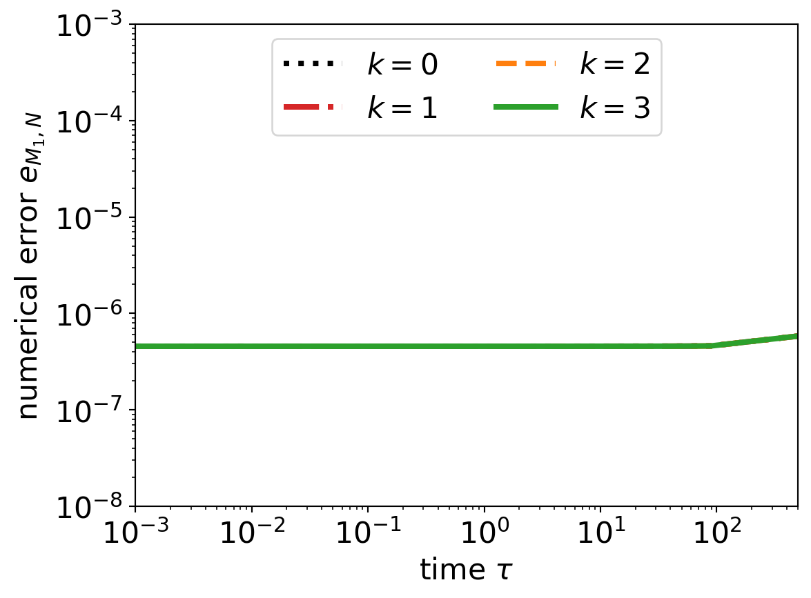

# Fragmentation with discontinuous Galerkin schemes: non-linear fragmentation
by Maxime Lombart, Mark Hutchison and Yueh-Ning Lee

Manuscript is published in the Monthly Notices of the Royal Astronomical Society  <br />
https://ui.adsabs.harvard.edu/abs/2022MNRAS.517.2012L/abstract

This repository contains the data and scripts used to reproduce all figures shown in the paper.

## Abstract
Small grains play an essential role in astrophysical processes such as chemistry, radiative transfer, and gas/dust dynamics. The population of small grains is mainly maintained by the fragmentation process due to colliding grains. An accurate treatment of dust fragmentation is required in numerical modelling. However, current algorithms for solving fragmentation equation suffer from an overdiffusion in the conditions of 3D simulations. To tackle this challenge, we developed a discontinuous Galerkin scheme to solve efficiently the non-linear fragmentation equation with a limited number of dust bins.

## Results
Python 3 is used to produce figures for constant and multiplicative fragmentation kernels.

### Benchmarks
#### Multiplicative kernel
Data are located in ``` kmul/data/```.
Python scripts are located in ``` kmul/scripts/```.

##### Positivity, mass conservation and accuracy
The corresponding script is ``` plot_linlog_kmul.py ```.

<p align="middle">
   
</p>

The corresponding scripts are ``` plot_loglog_kmul.py ``` and ``` plot_M1_kmul.py ```.
<div class="row">
   
   
</div>

###### Stability in time
The corresponding script is ``` plot_errors_kmul.py ```.

<p align="middle">
   
   
</p>

###### Convergence analysis
The corresponding script is ``` plot_EOC_kmul.py ```. 
<p align="middle">
   
   
</p>


#### Constant kernel
Data are located in ``` kconst/data/```.

##### Positivity, mass conservation and accuracy
The corresponding script is ``` plot_linlog_kconst.py ```.

<p align="middle">
   
</p>

The corresponding scripts are ``` plot_loglog_kconst.py ``` and ``` plot_M1_kconst.py ```.
<div class="row">
   
   
</div>

###### Stability in time
The corresponding script is ``` plot_errors_kconst.py ```.

<p align="middle">
   
   
</p>

###### Convergence analysis
The corresponding script is ``` plot_EOC_kconst.py ```. 
<p align="middle">
   
   
</p>


   

